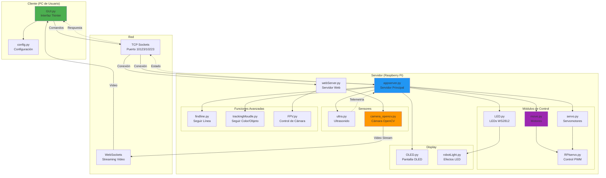
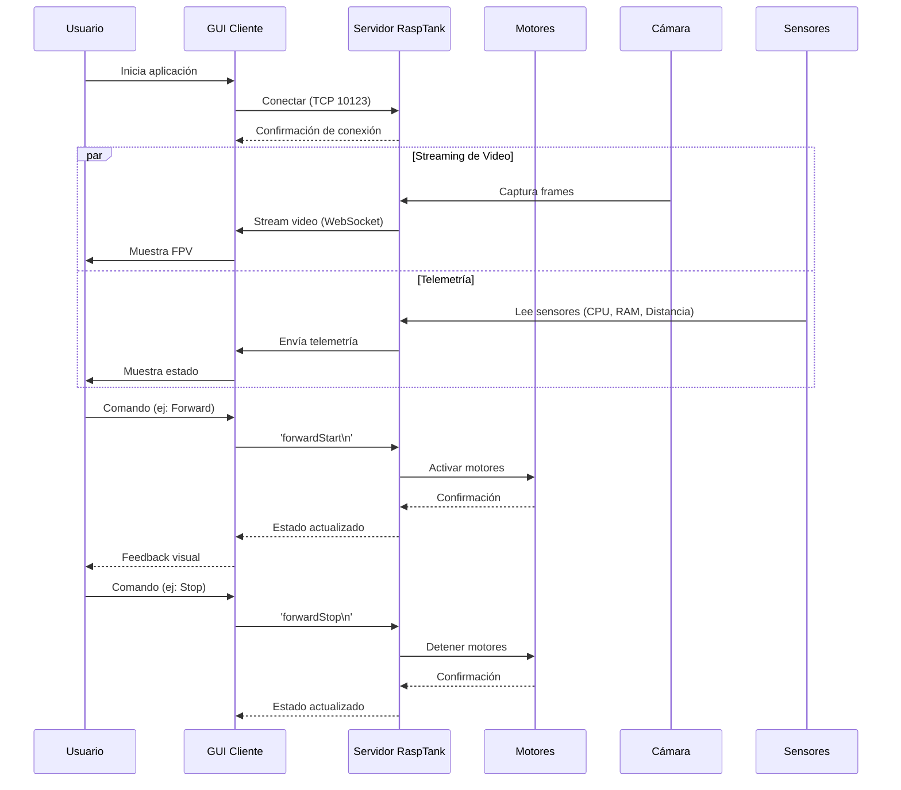
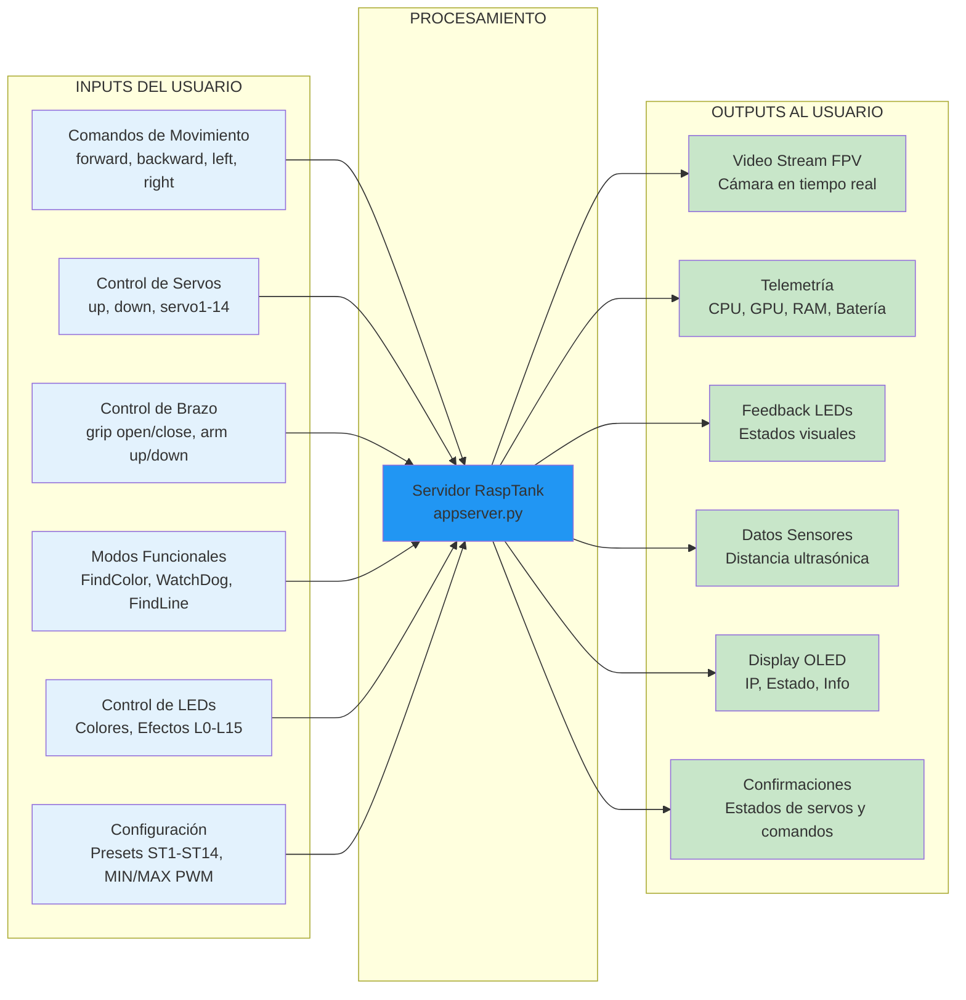
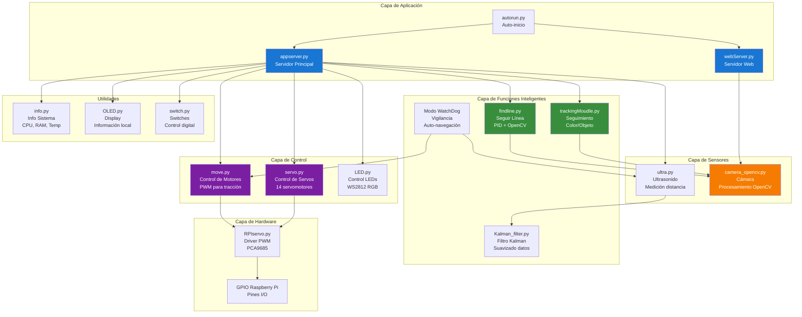
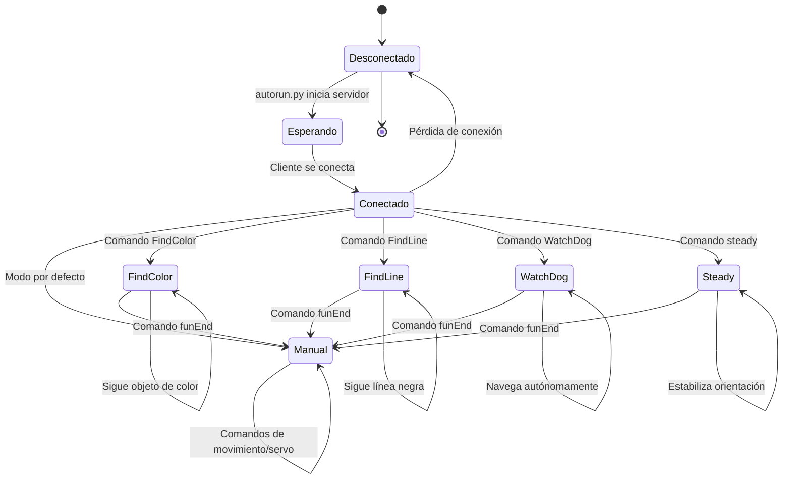
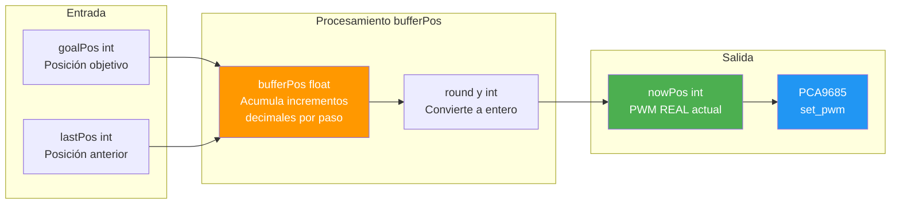

# Sesión de Estudio — Adeept RaspTank
> Fecha: 26 de Febrero de 2026

---

## Índice

1. [Resumen de la Conversación](#1-resumen-de-la-conversación)
2. [Proyecto a Grandes Rasgos](#2-proyecto-a-grandes-rasgos)
3. [BufferPos y PWM de Servos](#3-bufferpos-y-pwm-de-servos)
4. [Cómo Imprimir el PWM de Cada Servo en Consola](#4-cómo-imprimir-el-pwm-de-cada-servo-en-consola)
5. [Arquitectura Completa con Diagramas](#5-arquitectura-completa-con-diagramas)
6. Sesión — WebServer, AsyncIO y Flujo del Comando `grab`/`catch`

---

## 1. Resumen de la Conversación

Esta sesión cubrió tres temas principales sobre el proyecto **Adeept RaspTank**:

| Tema | Descripción |
|------|-------------|
| Arquitectura general | Se analizó la estructura cliente-servidor, módulos, inputs y outputs |
| `bufferPos` en RPIservo.py | Se explicó qué almacena, para qué sirve y cómo usarlo |
| Lectura de PWM en consola | Se mostró cómo imprimir los valores PWM de cada servo igual que los estados existentes |

---

## 2. Proyecto a Grandes Rasgos

El proyecto es un **robot controlado remotamente** basado en Raspberry Pi con arquitectura **cliente-servidor TCP**.

### Componentes principales

- **Servidor** (`server/`): Corre en la Raspberry Pi, controla hardware
- **Cliente** (`client/` y `GUI/`): Corre en PC, interfaz gráfica Tkinter
- **Comunicación**: TCP Sockets puertos 10123/10223 + WebSocket para video

### Inputs del usuario

```
forwardStart / backwardStart / leftStart / rightStart   → Movimiento
upStart / downStart / aStart / bStart / cStart / dStart → Servos y brazo
FindColor / FindLine / WatchDog / steady / funEnd        → Modos funcionales
L0-L15                                                   → Control de LEDs
ST1-ST14 / MIN / MAX                                     → Configuración PWM
```

### Outputs al usuario

```
Video Stream FPV         → Cámara en tiempo real
Telemetría               → CPU, GPU, RAM, temperatura, batería
Feedback LEDs WS2812     → Estados visuales (verde=OK, rojo=error)
Sensor ultrasónico       → Distancia en cm
Display OLED             → IP, estado, info del sistema
Confirmaciones TCP       → Estados de servos ST1-ST14
```

---

## 3. BufferPos y PWM de Servos

### ¿Qué es `bufferPos`?

Es un **array de 16 posiciones flotantes** en `RPIservo.py` que almacena posiciones intermedias para **interpolar movimientos suaves**. No contiene el PWM real enviado al servo.

### Variables del sistema de posición

```python
self.initPos    = [300]*16    # Posición de inicio configurada
self.lastPos    = [300]*16    # Última posición conocida (int)
self.nowPos     = [300]*16    # ✅ PWM ACTUAL enviado al servo (int)
self.bufferPos  = [300.0]*16  # Acumulador float para interpolación suave
self.goalPos    = [300]*16    # Posición objetivo del movimiento
```

### Rol del buffer en `moveCert()`

```python
def moveCert(self):
    while self.nowPos != self.goalPos:
        for i in range(0,16):
            if self.lastPos[i] < self.goalPos[i]:
                self.bufferPos[i] += self.pwmGenOut(self.scSpeed[i])/(1/self.scDelay)
                #                    ↑ acumula incrementos decimales
                newNow = int(round(self.bufferPos[i], 0))
                #         ↑ convierte a entero para enviar al hardware
                self.nowPos[i] = newNow
                pwm.set_pwm(i, 0, self.nowPos[i])
```

### ¿De dónde obtener el PWM real?

| Variable | Tipo | ¿Tiene el PWM real? |
|----------|------|---------------------|
| `nowPos[i]` | `int` | ✅ **SÍ — usar este** |
| `bufferPos[i]` | `float` | ❌ No (tiene decimales intermedios) |
| `lastPos[i]` | `int` | Sí (valor anterior) |
| `goalPos[i]` | `int` | Sí (valor futuro/objetivo) |

---

## 4. Cómo Imprimir el PWM de Cada Servo en Consola

Para imprimir los PWM de los servos igual que se imprimen otros estados en el proyecto, agregar dentro del método `run()` de `ServoCtrl` en `RPIservo.py`:

### Opción A — Imprimir en cada ciclo de movimiento (dentro de `scMove`)

```python
def scMove(self):
    if self.scMode == 'init':
        self.moveInit()
    elif self.scMode == 'auto':
        self.moveAuto()
    elif self.scMode == 'certain':
        self.moveCert()
    elif self.scMode == 'wiggle':
        self.moveWiggle()

    # Imprimir PWM actual de todos los servos
    print(f'[ServoCtrl] nowPos: {self.nowPos}')
```

### Opción B — Método dedicado para imprimir estado

```python
def printServoStatus(self):
    print('=' * 60)
    print(f'[ServoCtrl] Modo actual: {self.scMode}')
    for i in range(16):
        print(f'  Servo {i:02d} → PWM actual: {self.nowPos[i]:4d}  |  objetivo: {self.goalPos[i]:4d}  |  buffer: {self.bufferPos[i]:7.2f}')
    print('=' * 60)
```

Llamarlo desde `appserver.py` o `webServer.py`:

```python
# En appserver.py, donde ya se imprimen otros estados:
scGear.printServoStatus()
```

### Opción C — En `__main__` del propio RPIservo.py (para pruebas)

```python
if __name__ == '__main__':
    sc = ServoCtrl()
    sc.start()
    while 1:
        sc.moveAngle(0, 45)
        time.sleep(0.5)

        # Imprime todos los PWM actuales
        print(f'[PWM] Servo 0: {sc.nowPos[0]}')
        print(f'[PWM] Todos:   {sc.nowPos}')
        time.sleep(0.5)
```

### Ejemplo de salida esperada en consola

```
============================================================
[ServoCtrl] Modo actual: auto
  Servo 00 → PWM actual:  345  |  objetivo:  400  |  buffer:  345.00
  Servo 01 → PWM actual:  300  |  objetivo:  300  |  buffer:  300.00
  Servo 02 → PWM actual:  280  |  objetivo:  280  |  buffer:  280.00
  ...
  Servo 14 → PWM actual:  310  |  objetivo:  350  |  buffer:  310.00
  Servo 15 → PWM actual:  300  |  objetivo:  300  |  buffer:  300.00
============================================================
```

---

## 5. Arquitectura Completa con Diagramas

### Diagrama General de Arquitectura



### Flujo de Comunicación



### Inputs y Outputs del Sistema



### Módulos del Servidor y sus Responsabilidades



### Modos de Operación



### Sistema de Posición de Servos (RPIservo.py)



### Estructura de Archivos Clave

```mermaid
graph TD
    Root[adeept_rasptank]

    Root --> Auto[autorun.py<br/>Script de auto-inicio]
    Root --> Setup[setup.py<br/>Instalación]
    Root --> Config[config.json<br/>Configuración global]
    Root --> Wifi[wifi_hotspot_manager.sh<br/>Gestión WiFi AP]

    Root --> ClientDir[client/]
    Root --> GUIDir[GUI/]
    Root --> ServerDir[server/]

    ClientDir --> CGUI[GUI.py<br/>Interfaz gráfica]
    ClientDir --> CConf[config.py<br/>Config cliente]
    ClientDir --> CReq[requirements.txt]

    ServerDir --> SApp[appserver.py<br/>Servidor principal]
    ServerDir --> SWeb[webServer.py<br/>Servidor web]
    ServerDir --> SMove[move.py<br/>Motores]
    ServerDir --> SServo[servo.py / RPIservo.py<br/>Servos PWM]
    ServerDir --> SCam[camera_opencv.py<br/>Cámara]
    ServerDir --> SFind[findline.py<br/>Seguir línea]
    ServerDir --> STrack[trackingMoudle.py<br/>Seguimiento]
    ServerDir --> SLED[LED.py<br/>LEDs]
    ServerDir --> SUltra[ultra.py<br/>Ultrasonido]
    ServerDir --> SInfo[info.py<br/>Telemetría]
    ServerDir --> SOLED[OLED.py<br/>Display]

    style Root fill:#FFF9C4
    style ClientDir fill:#BBDEFB
    style GUIDir fill:#BBDEFB
    style ServerDir fill:#C8E6C9
```



---

## Tecnologías Utilizadas

| Capa | Tecnología |
|------|------------|
| Hardware | Raspberry Pi, PCA9685 (PWM I2C), WS2812 LEDs, HC-SR04 (Ultrasonido), Cámara USB/CSI |
| Backend | Python 3.x, Socket TCP, OpenCV, RPi.GPIO, Adafruit_PCA9685 |
| Frontend | Tkinter (GUI Desktop) |
| Procesamiento | Control PID, Filtro de Kalman, Visión por computadora |
| Comunicación | TCP Sockets (10123/10223), HTTP, WebSocket |
| Auto-inicio | systemd / rc.local |
| Networking | WiFi cliente o modo Access Point |

---

## 6. Sesión — WebServer, AsyncIO y Flujo del Comando `grab`/`catch`

> Fecha: sesión actual

### Resumen

Se analizó el flujo completo del comando de agarre del robot, desde el evento en la GUI del cliente hasta el movimiento físico del servo en la Raspberry Pi.

---

### 6.1 Flujo completo del comando `catch` / `grab`

#### Desde la GUI Tkinter (`GUI/GUI.py` y `client/GUI.py`)

```
Evento del usuario
  ├── <ButtonPress-1> en Btn_left  →  call_headleft(event)
  └── <KeyPress-j>                 →  call_headleft(event)
             │
             │  tcpClicSock.send(('catch').encode())
             ▼
        TCP Socket puerto 10223
```

#### En el servidor (`server/webServer.py`)

El servidor NO usa TCP clásico para esto — usa **WebSocket** (puerto 8888, librería `websockets` + `asyncio`):

```
websockets.serve(main_logic, '0.0.0.0', 8888)
         │
         └── main_logic(websocket, path)
                  │
                  ├── check_permit(websocket)   ← autenticación admin:123456
                  └── recv_msg(websocket)        ← loop principal de comandos
                           │
                           │  data = await websocket.recv()
                           │
                           └── robotCtrl(data, response)
                                    │
                                    ├── 'grab'  → G_sc.singleServo(15, 1, 3)
                                    └── 'loose' → G_sc.singleServo(15, -1, 3)
```

#### En RPIservo.py

```python
def singleServo(self, ID, direcInput, speedSet):
    self.wiggleID = ID             # servo 15
    self.wiggleDirection = direcInput  # 1 = cerrar, -1 = abrir
    self.scSpeed[ID] = speedSet    # velocidad 3
    self.scMode = 'wiggle'
    self.posUpdate()
    self.resume()                  # desbloquea el hilo → run() → scMove() → moveWiggle()
```

---

### 6.2 Instancias de ServoCtrl en webServer.py

| Variable  | Servo ID | Controla          |
|-----------|----------|-------------------|
| `scGear`  | 0        | Dirección ruedas  |
| `P_sc`    | 14       | Pan (izq/der)     |
| `T_sc`    | 11       | Tilt (arriba/abajo)|
| `H1_sc`   | 12       | Brazo articulación 1 |
| `H2_sc`   | 13       | Brazo articulación 2 |
| `G_sc`    | 15       | Gripper (agarre)  |

---

### 6.3 Diferencia entre GUI Tkinter y WebServer

| Aspecto | GUI/client | webServer |
|---------|-----------|-----------|
| Protocolo | TCP Socket puerto 10223 | WebSocket puerto 8888 |
| Comando grab | `'catch'` | `'grab'` |
| Comando soltar | `'loose'` | `'loose'` |
| Concurrencia | `threading.Thread` | `asyncio` (event loop) |

> ⚠️ **Nota:** La GUI Tkinter envía `'catch'`, pero `webServer.py` espera `'grab'`. Son dos interfaces distintas para el mismo robot.

---

### 🔴 TODO — Pendientes de Investigar

#### 1. Hilos reales (`threading`) vs hilo del WebSocket (`asyncio`)

- `ServoCtrl` hereda de `threading.Thread` → corre en un **hilo real del SO**
- `recv_msg` corre en el **event loop de asyncio** → es concurrencia cooperativa, NO hilos reales
- **Pregunta abierta:** ¿Hay condiciones de carrera entre el event loop de asyncio y los hilos de `ServoCtrl`? ¿Es thread-safe llamar a `G_sc.singleServo()` desde una coroutine de asyncio?
- Investigar si hace falta usar `asyncio.get_event_loop().run_in_executor()` para las llamadas a servo

#### 2. Imprimir en consola el arreglo de posiciones de servos

- `nowPos` es el array con el PWM real enviado al hardware
- Actualmente no se imprime en ningún punto del flujo de webServer
- Opciones a implementar (ver Sección 4 de este archivo):
  - Opción A: dentro de `scMove()` de `RPIservo.py`
  - Opción B: método `printServoStatus()` llamado desde `robotCtrl()`
- **Pendiente:** decidir en qué punto del loop de `recv_msg` conviene imprimir sin saturar la consola

#### 3. `self.nowPos` e `initPos` siempre regresan a valores iniciales

- **Problema observado:** Al imprimir `nowPos` en consola, los valores siempre aparecen en sus valores de inicialización (ej. `300`) aunque el servo físicamente se mueva
- **Posibles causas a investigar:**
  - Cada instancia de `ServoCtrl` tiene su **propio array** `nowPos` — puede que se esté leyendo la instancia incorrecta
  - `posUpdate()` sobreescribe `lastPos` con `nowPos` pero `nowPos` puede no actualizarse en modo `wiggle`
  - En `moveWiggle()`, `nowPos` se actualiza con `self.nowPos[self.wiggleID]` — verificar si el índice `wiggleID` es el correcto (servo 15 para gripper)
  - `scGear` llama `moveInit()` pero **no llama `start()`** — podría estar en estado pausado permanente
  - Verificar que se está imprimiendo la instancia correcta (`G_sc.nowPos` para el gripper, no `scGear.nowPos`)

```python
# Para debuggear, imprimir la instancia CORRECTA:
print(f'[G_sc gripper] nowPos[15]: {G_sc.nowPos[15]}')
print(f'[P_sc pan]     nowPos[14]: {P_sc.nowPos[14]}')
print(f'[T_sc tilt]    nowPos[11]: {T_sc.nowPos[11]}')
```

---
